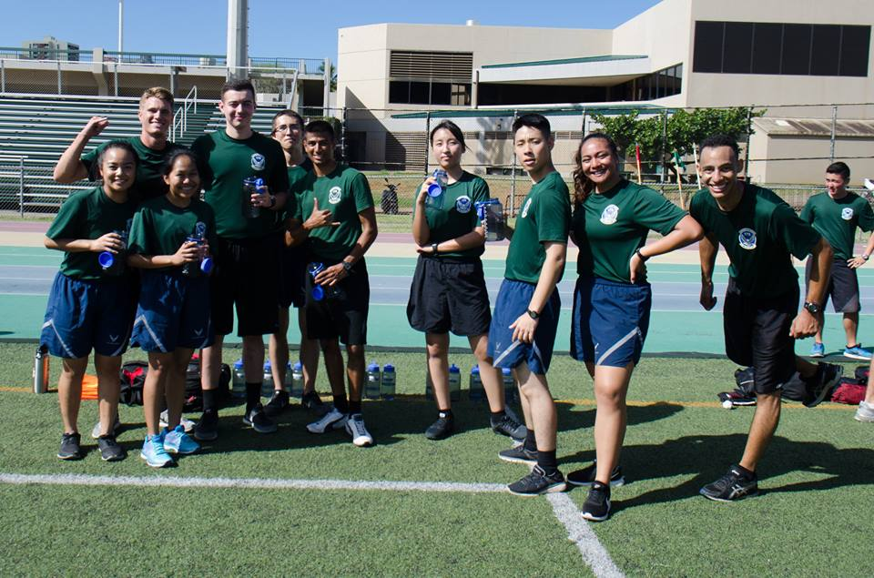
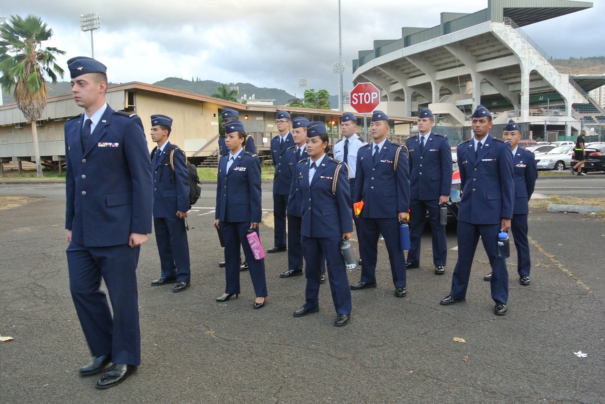
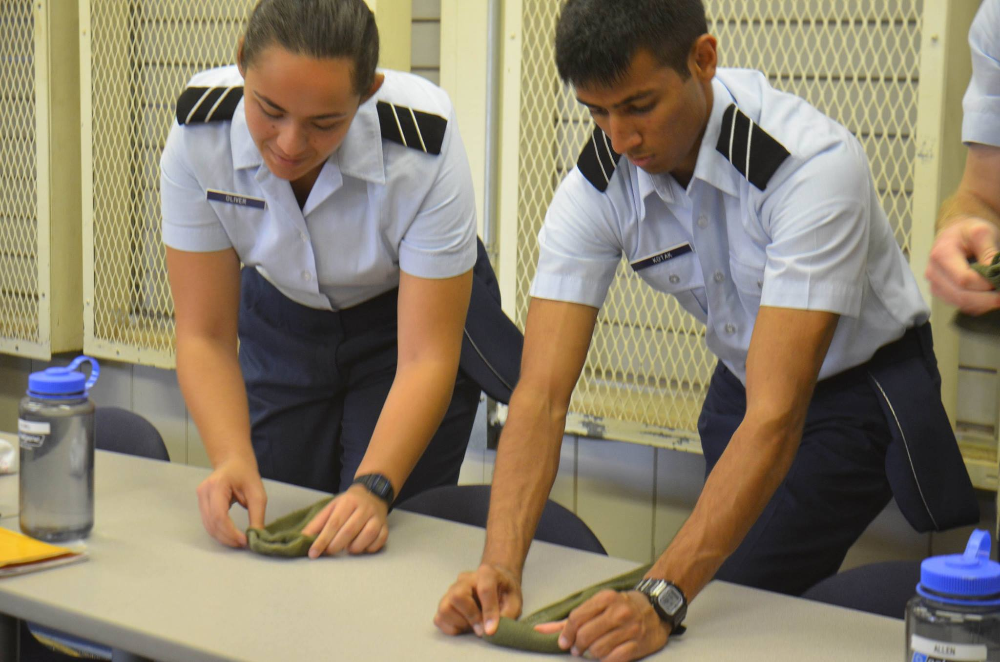
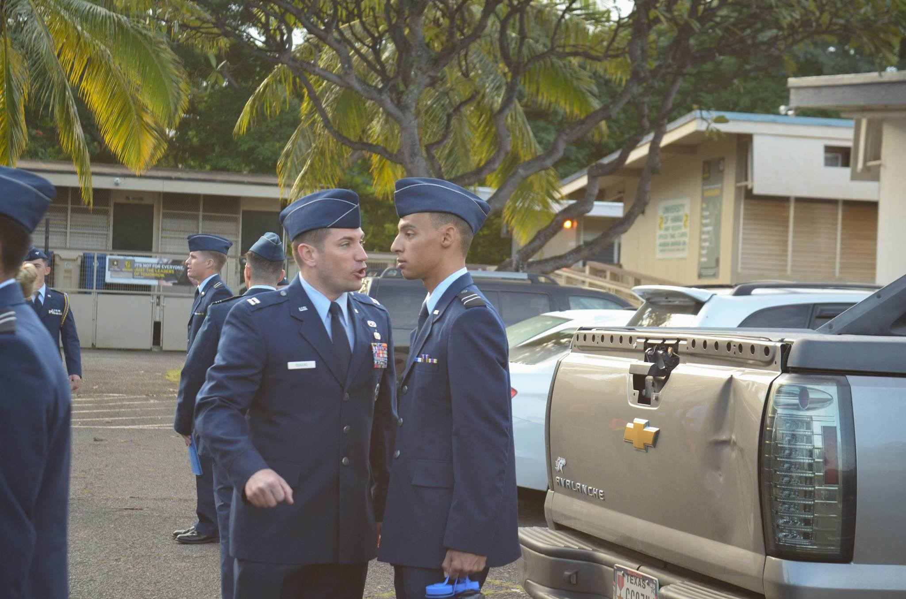
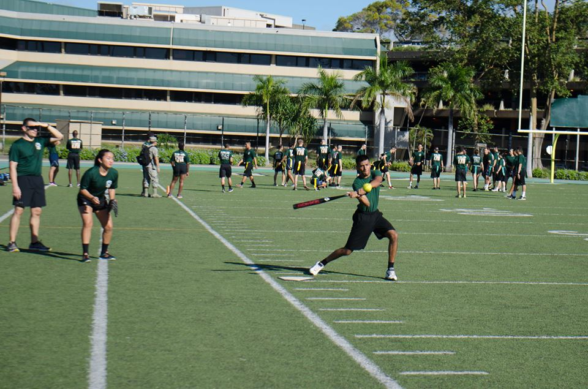

# The Way of the Na Koa Lani
Na Koa Lani means heavenly warriors and is the motto of the Air Force Reserve Officers Training Corp
(AFROTC) detachment at the University of Hawaii at Manoa. I joined AFROTC directly after high school
with no service obligation, I did this because of the scholarship opportunities and to develop my
leadership skills. This would probably become the best decision of my life. After a semester, I was
awarded a 3.5 year scholarship, which I accepted. The skills I learned are invaluable, the experiences were indispensable, and the people were unforgettable. Being an AFROTC Cadet becomes a
lifestyle, I became a part of something bigger than myself, and I became immersed in my training
with the hope to be molded into an adept leader.

# Training/Classes
The first two years are spent in the General Military Course (GMC). Then, the Cadets who receive 
Enrollment Allocations(EAs) in the final semester go to Field Training (FT) where they are put in a 
high stress environment and evaluated on leadership performance. After FT, Cadets are put in charge 
of leading underclassmen, and are in the Professional Officer Course (POC). After your 2 years in the 
POC, you would commission as a Second Lieutenant into the Air Force. 

## General Military Course
In the classroom, I learned about Air Force customs and courtesies, heritage, evolution of air and 
space power, gave informational briefings and wrote informative papers. During physical training,
I woke up every Wednesday and Friday at 0400 to get to formation at 0530. I Kept my physical fitness up
and scored extremely high on the fitness assessment. In the actual Leadership Laboratories, where we
are taught with a hands on approach, I was put into stressful and challenging situations, and was
expected to perform at a high level. We would march, solve Group Leadership Problems (GLPs), sometimes
these would be done on Cadets individually, but the performance of the team was the focal point of success. We would be supervised by Cadets in the POC, while all Cadets were being evaluated by Cadre.
In the second half of my GMC year, I entered Field Training Preparation (FTP). The stress was higher,
problems were harder and we were all meticulously evaluated to see if we could go to training and return
as POC. We were also expected to take and pass the Air Force Officer Qualifying Test (AFOQT) before 
we could even receive an EA. Over my GMC, I learned to manage time between college and AFROTC, I 
learned to have the self-discipline to wake up at 0400, to be able to learn a culture and heritage of 
an extremely large and effective organization, and to prepare for events that were rather difficult 
and tedious to be ready 
for(FT and AFOQT). In the end, I was able to pass the AFOQT and earn an EA and went to Field 
Training. 

## Field Training
Field training is like Leadership Laboratory, except more stress, more challenging problems, and it
was for 18 days straight. All the prepartion from the GMC years was for this, this one training, designed
to test you mentally, physically, and emotionally. It tests if you are able to lead people in a high
stress environment and when you are always exhausted. What nearly everyone says after completeing it 
is "The best experience of your life you never want to have again." and I wholeheartedly agree. I am
grateful for the experience, but I would not want to do it again. I learned so much about team and 
leadership dynamics, like delegation, decentralized command, different leadership models, motivation 
and much more. I completed Field Training the Summer of 2017.

## Professional Officer Course
I have now entered the POC, and now need to set the standard for all the GMC Cadets. In the classroom, 
I learn about conflict management, leadership and authority, mentoring, standards and accountability,
and debate ethical implications of certain situations and views. Not much changes at physical training,
except we must lead GMC Cadets on physical standards by example. During Leadership Laboratory, there 
is even more pressure to perform because the entire Cadet Wing needs you to do your job, otherwise you
let not only yourself down, but everyone above and below you. I now carry more responsibilities and
am currently the mentorship officer. It is my duty to create an effective mentoring program for the
Cadet Wing, and lead all GMC Cadets by example.

# Overall Lessons Learned
Overall, so far into my AFROTC career, I have learned time management, self-discipline, leadership skills,
interpersonal skills, public speaking skills, reading and writing skills, and the list goes on. The 
skills I developed in AFROTC will stay with me forever and they are invaluable, just like all
the people I met through AFROTC. AFROTC is a unique experience and differs from a regualar college
class because it gives "life" skills, which are impossible to learn in a classroom.

Check out Detachment 175 on [Facebook](https://www.facebook.com/universityofhawaiiairforcerotc/).
For AFROTC in general see the [AFROTC Official Website](https://www.afrotc.com/)
