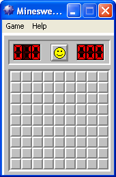

I created this Java rendition of the classic Minesweeper game with two other students (Troy Carson,
Zachary Heth) in my ICS 211 data structures class.

It uses a Graphical User Interface and is implemented using the Java programing language. I handled
most of the front end on this project, while my teammates did the backend.

Although not a large project, it was a good introduction and learning experience for Graphical User 
Interfaces in Java. 

See the code on [GitHub](https://github.com/neelkotak13/Minesweeper).
