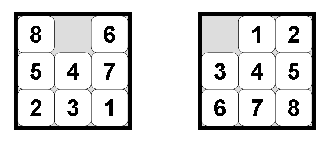

Three problems to solve: farmer, goat, wolf cabbage puzzle] (https://www.mathsisfun.com/puzzles/farmer-crosses-river-solution.html),[8 tile puzzle](http://mypuzzle.org/sliding), and [the water jug problem](http://www.math.tamu.edu/~dallen/hollywood/diehard/diehard.htm).

This project was done for an introductory class to artificial intelligence. For the 8-puzzle specifically,
there are three different heuristics used to see which is most effective.

See the code on GitHub [here](https://github.com/neelkotak13/ICS361_HW3). 

