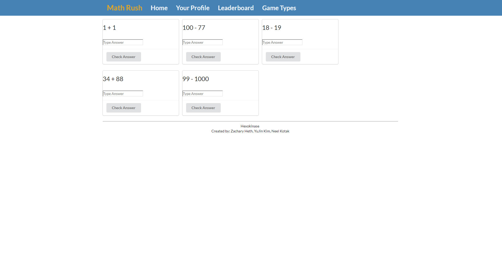
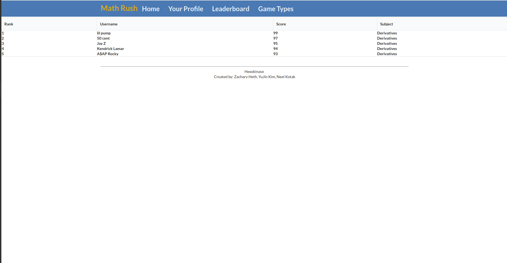

# The Vision
To create a fun and exciting way for college students to practice the math subjects they are taking while connecting with other top performers.

# The Idea
We want to partner with the Mathematics Department professors. Professors would be able to create courses that
would mirror those they teach. A student could sign up for a course, which would give them access to the games
specific to that subject. The games page would update automatically for new topics according to the course
schedule. Students would still have access to games about previous topics, but the showcased games would reflect
the topics they are currently learning in class. The professors would create the games using templates that we
provide. This would make math more fun and less dry, and could be used as extra credit, or a portion of coursework,
either way, it can definitely benefit both students and professors.

# What I did
This project was done with two of my classmates in my ICS 314 Software Engineering class, YuJin Kim and Zachary
Heth. We used the meteor framework with HTML and Semantic UI to create a modern web application. I specifically
designed the leader board page, although it is far from done, I used semantic UI and the grid class to create it.
The plan is to create a database of high scores and project it on this page, but as of now, it is just a mock up.
I also linked all the separate pages together using the flow router, as we all originally created separate pages.
I also created the Navigation bar on the top of the pages, as well as the footer on the bottom of the pages. I used
a layout scheme that I implemented onto all on the pages on our website, excluding the landing page.

# What I Learned
Development on the small scale seems easy, but when you put it even on a moderate level, it becomes much more
complex. With a group, the communication has to be solid. I am very thankful for github, as it makes life, ten times
easier. Even with modern development tools, face to face interaction and meetings are mandatory. The experience of
working on a team on a legitimate, realistic project with deadlines and problems in a "sandbox" like environment
made it a great experience. It really makes me appriciate how professional software engineers are able to get
things done. The biggest things I learned from this software engineering class are not the technical tools and
languages, but the more general and purposeful experiences, as well as the software engineering process as a
whole.   

See the code on GitHub [here](https://github.com/hexokinase/math-rush).
More information on the github.io page [here](https://hexokinase.github.io/)!
